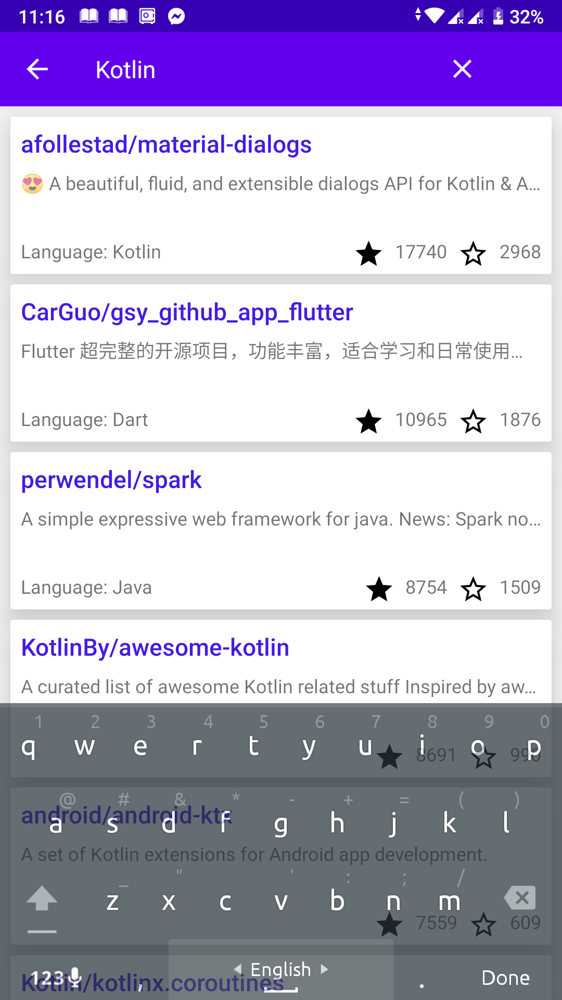

# Github Repo Search in Kotlin (Android Paging Network + Database)

## Components Used

1. **ViewModel** 
2. **Room Database**
3. **Retrofit Api**
4. **Github Repositories Api**
5. **Kotlin Coroutine**
6. **Language** - Kotlin
7. **Ref** - [Android Paging](https://codelabs.developers.google.com/codelabs/android-paging/#2) 




## Description
The project is an modified version of android paging. Instead of [Executor](https://developer.android.com/reference/java/util/concurrent/Executor) used while inserting data to,
cache(Room Database) Kotlin ```Coroutine``` is used and delete operation is perfored when activity ```onDestroy()``` is called, otherwise the size room database(local cache) will increase. Changes 
also made in UI(search in the action bar) and recyclerview in a fragment and they communicate through viewmodel.
